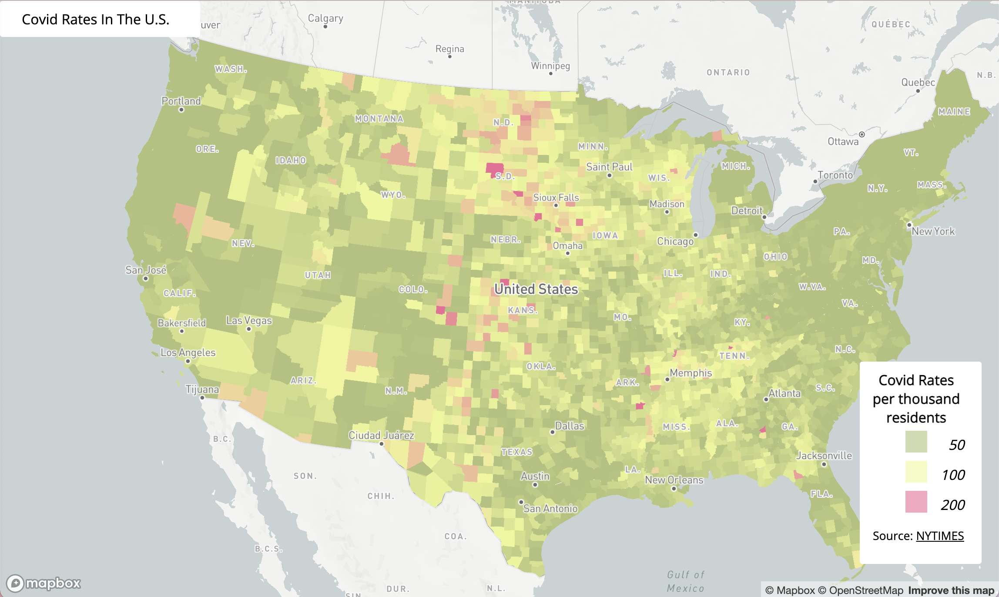
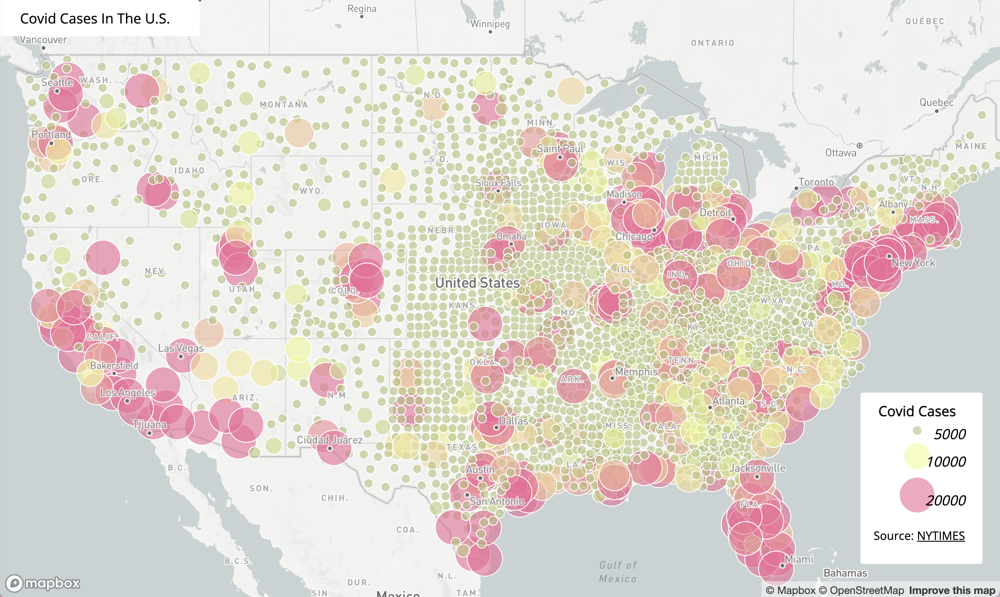

## Covid-19 in United States of America in 2020.

The name of this project is comparing number of cases and rates of Covid-19 cases in United States of America. The choropleth map shows the covid-19 rates in the year 2020. The Covid-19 cases is shown through the proportional symbol map. The project is uploaded on Github with the use of VSCode. Both of the map are interactives, and presented with legend and title at the top. The base map is from Mapbox GL JS. One of the functions that is included in the map is mainly the pop-up event. I used the mapboxgl.Popup() in order to make it work. I also added another line of code to have the county name present; i did this by adding another event feature to setHTML. Furthermore, the choropleth map used the projection called albers, which I added to the script part.

### Covid-19 Rates 

[Interactive Map of Covid-19 Rate](http://127.0.0.1:5500/map1.html)

This is choropleth map of the Covid-19 rate in the United States of America in the year 2020. The rate is calculated by the number of Covid Cases by the population;the population used to calculate the case rate is from the [2018 ACS 5 year estimates](https://data.census.gov/cedsci/table?g=0100000US.050000&d=ACS%205-Year%20Estimates%20Data%20Profiles&tid=ACSDP5Y2018.DP05&hidePreview=true). This map shows rate by county level. When clicking on each county, you will be able to see the county name and the rate. The rate is represented per thousand residents. The lowest rate county is San Juan, WA. And the highest county is Crowley, Colorado. 
    
### Covid-19 Cases

[Interactive Map of Covid-19 Count](http://127.0.0.1:5500/map2.html)

 This is a proportional symbol map of Covid-19 cases in the United States of America in the year 2020. This interactive map shows the number of cases by county level. The size of the cicle varies relative to each other. The lowest case county is Loving, Texas; while the highest county is Los Angeles, CA. 

## Sources
<ul>
    <li>The Covid-19 data is from (https://github.com/nytimes/covid-19-data/commits/43d32dde2f87bd4dafbb7d23f5d9e878124018b8/live/us-counties.csv?author=nyt-covid-19-bot)</li>
    <li>Population data is from (https://data.census.gov/cedsci/table?g=0100000US.050000&d=ACS%205-Year%20Estimates%20Data%20Profiles&tid=ACSDP5Y2018.DP05&hidePreview=true)</li>
    <li>The code for the maps were adjusted from Professor's Bo Zhao</li>
</ul>

